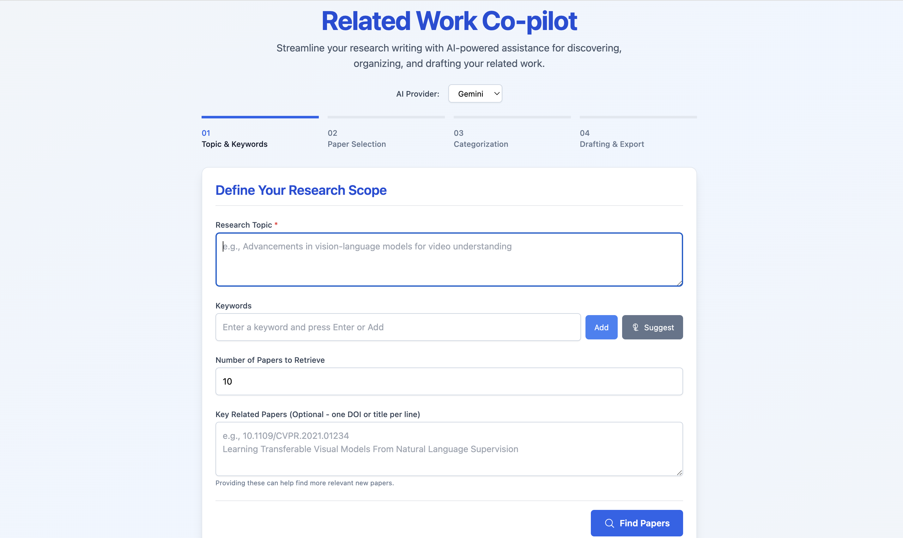

# 🚀 Related Work Co-pilot

Related Work Co-pilot is an application designed to assist researchers in drafting the related work section of their academic papers. It leverages AI (Google Gemini or OpenAI) and the arXiv API to help with:

-   Defining a research topic and keywords.
-   Suggesting additional keywords.
-   Discovering relevant papers from arXiv.
-   Refining paper searches using AI-augmented queries (RAG-style).
-   Categorizing selected papers into sections.
-   Automatically assigning papers to suggested sections.
-   Drafting the related work section in text or LaTeX format.
-   Refining the generated draft through interactive queries.
-   Generating BibTeX entries for selected papers.

<div align="center">
  
</div>

## ✨ Features

-   **📊 Step-by-Step Workflow**: Guides users through topic definition, paper selection, categorization, and drafting.
-   **🤖 Dual AI Provider Support**: Choose between Google Gemini and OpenAI models.
-   **📚 Real Paper Search**: Integrates with the arXiv API to find actual research papers.
-   **💡 AI-Powered Keyword Suggestion**: Get help brainstorming relevant keywords.
-   **🔍 RAG-Enhanced Paper Refinement**: Uses AI to generate better search queries for arXiv based on user-selected papers.
-   **🗂️ AI-Powered Section Suggestion & Paper Assignment**: Automatically suggests section structures and assigns papers.
-   **✍️ Interactive Drafting and Refinement**: Generate an initial draft and iteratively improve it with AI assistance.
-   **📄 Text and LaTeX Output**: Export your draft in your preferred format.
-   **📖 BibTeX Generation**: Easily get BibTeX entries for all selected papers.
-   **📱 Responsive UI**: User-friendly interface built with React and Tailwind CSS.

## 📋 Prerequisites

-   [Node.js](https://nodejs.org/) (LTS version recommended, e.g., v18 or v20+)
-   [npm](https://www.npmjs.com/) or [yarn](https://yarnpkg.com/)

## 🛠️ Setup and Configuration

1.  **Clone the repository:**
    ```bash
    git clone https://github.com/your-username/related-work-copilot.git
    cd related-work-copilot
    ```

2.  **Install dependencies:**
    ```bash
    npm install
    # or
    yarn install
    ```

3.  **🔑 API Key Configuration (VERY IMPORTANT):**
    This application requires API keys for Google Gemini and/or OpenAI to use their respective AI models. You also interact with the public arXiv API (which doesn't require a key).

    *   Create a file named `.env` in the root of the project directory.
    *   Add your API keys to this file. **This file should NOT be committed to version control.** The `.gitignore` file is already set up to ignore it.

    Your `.env` file should look like this:

    ```env
    # Get your Gemini API key from: https://ai.google.dev/
    VITE_GEMINI_API_KEY=YOUR_GEMINI_API_KEY_HERE

    # Get your OpenAI API key from: https://platform.openai.com/api-keys
    VITE_OPENAI_API_KEY=YOUR_OPENAI_API_KEY_HERE
    ```

    -   Replace `YOUR_GEMINI_API_KEY_HERE` with your actual Google Gemini API key.
    -   Replace `YOUR_OPENAI_API_KEY_HERE` with your actual OpenAI API key.
    -   The application will pick up these keys. If a key is missing or invalid, the features relying on that specific AI provider will not work, and warnings will be logged in the browser console.

## 💻 Running the Application Locally

Once you have configured your API keys:

```bash
npm run dev
# or
yarn dev
```
This will start the Vite development server, typically at `http://localhost:5173`.

## 🚀 Building for Production

To create an optimized production build:

```bash
npm run build
# or
yarn build
```
The production-ready files will be in the `dist` folder. You can then deploy this folder to any static web hosting service.

## 📖 How to Use

1.  **Step 1: Topic & Keywords**
    *   Enter your main research topic.
    *   Add relevant keywords. You can also ask the AI to suggest keywords based on your topic.
    *   Specify the number of papers you'd initially like to retrieve from arXiv.
    *   Optionally, list any key related papers (DOIs or titles) that can help guide the initial search.
    *   Click "Find Papers".

2.  **Step 2: Paper Selection**
    *   The app will search arXiv based on your inputs.
    *   Review the list of papers. Click on a paper to select/deselect it. You can view abstracts.
    *   **Refine Search (AI Query + arXiv)**: If you select some papers, you can use this button. The AI (Gemini or OpenAI, based on your selection) will analyze your selected papers and your initial query to generate a *new, more focused search query* for arXiv. This helps you discover more relevant papers iteratively.
    *   Once satisfied with your selection, click "Proceed to Categorization".

3.  **Step 3: Categorization**
    *   Specify the desired number of sections for your related work.
    *   Click "Suggest & Assign". The AI will:
        *   Suggest names and descriptions for each section based on your selected papers.
        *   Automatically attempt to assign your selected papers to these new sections.
    *   Review and edit the section names, descriptions, and paper assignments. You can manually move papers between sections, add new sections, or remove sections.
    *   Click "Draft Related Work" when ready.

4.  **Step 4: Drafting & Export**
    *   The AI will generate a draft of your related work based on the defined sections and assigned papers.
    *   You can switch between "Text" and "LaTeX" format for the draft.
    *   **Refine Draft**: Enter a query (e.g., "Make section 2 more critical", "Expand on paper X") and click "Refine". The AI will revise the draft. A history of draft versions is kept, allowing you to restore a previous version.
    *   **BibTeX Entries**: A list of BibTeX entries for all selected papers is provided.
    *   **Copy/Download**: You can copy the draft or BibTeX to your clipboard, or download them as files.
    *   Click "Start New Draft" to go back to the beginning.

## 🤝 Contributing

Contributions are welcome! Please feel free to open an issue or submit a pull request.

## 📜 License

This project is licensed under a custom Non-Commercial Research License. See [LICENSE](LICENSE) for details.
